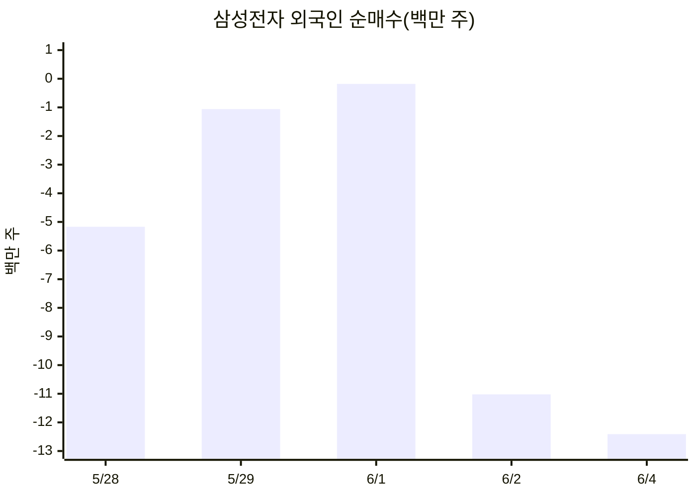
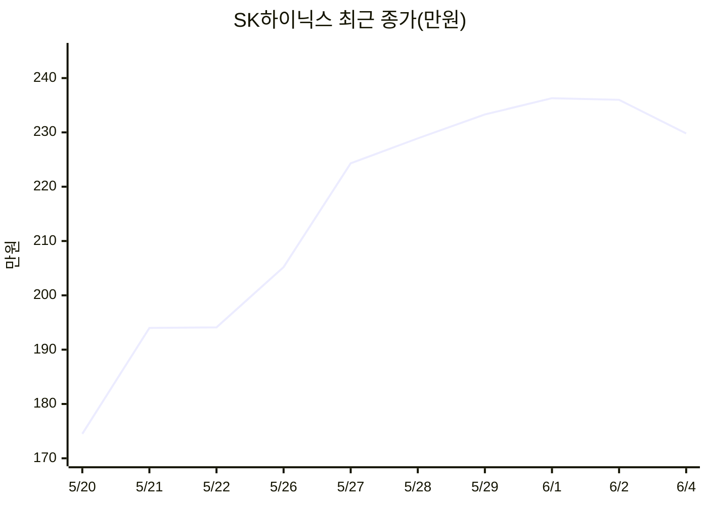
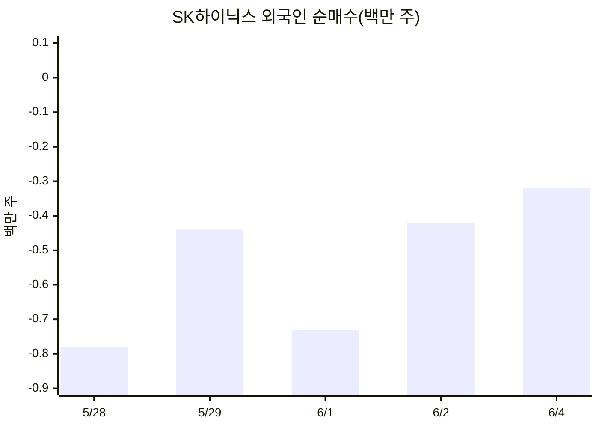
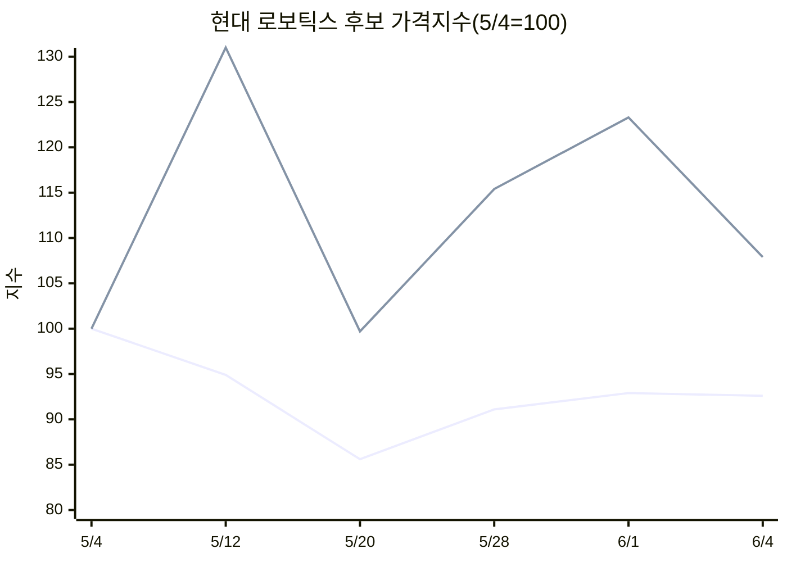
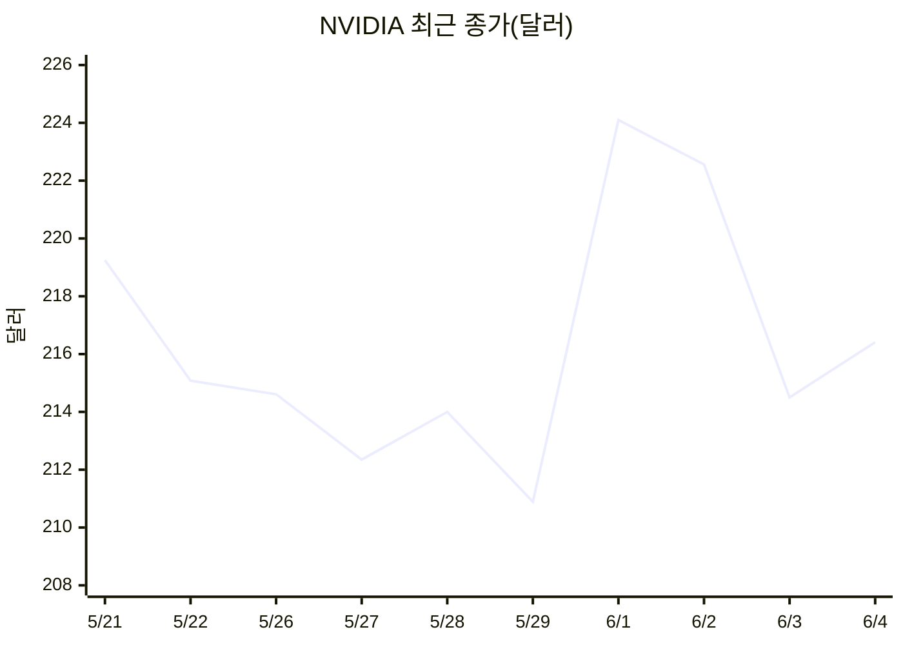

# 일일 투자 리포트 - 2026-06-04

## 1. 오늘의 결론

- 반도체 핵심 관찰 종목은 모두 단기 급등 이후 쉬어가는 흐름이다. 삼성전자 -2.50%, SK하이닉스 -2.63%로 조정했고, NVIDIA는 재조회 기준 2026-06-04 종가 216.4100달러, +0.89%로 일부 반등했다.
- 삼성전자와 SK하이닉스는 2026-06-02에 52주/연중 고점을 찍은 직후 조정 중이다. 추세는 아직 강하지만, 당일 외국인 순매도가 뚜렷하다.
- NVIDIA는 2026-06-01 종가 224.0988달러 이후 2026-06-03까지 조정했고, 2026-06-04에는 216.4100달러로 일부 반등했다. 그래도 2026-04-01 종가 175.5454달러와 비교하면 중기 상승 추세는 유지된다.
- `현대 로보틱스`는 KIS 종목명 검색에서 정확히 매칭되지 않았다. 후보로 `HD현대(267250)`와 `현대무벡스(319400)`가 확인됐지만, 사용자가 의도한 정확한 종목을 먼저 확정해야 한다.
- 오늘의 행동은 신규 추격매수보다 관망과 조건 정리다. 다음 리포트부터 종목이 늘어나도 같은 항목으로 누적할 수 있게 종목별 형식을 통일했다.

## 2. 포트폴리오 현황

| 종목코드 | 종목명 | 보유수량 | 평균단가 | 현재가/종가 | 평가손익 | 목표비중 | 메모 |
| --- | --- | ---: | ---: | ---: | ---: | ---: | --- |
| 005930 | 삼성전자 | 미기록 | - | 351,500원 | - | - | 관망 |
| 000660 | SK하이닉스 | 미기록 | - | 2,298,000원 | - | - | 관망 |
| 확인필요 | 현대 로보틱스 | 미기록 | - | - | - | - | 정확한 상장 종목명 확인 필요 |
| NAS:NVDA | NVIDIA | 미기록 | - | 일봉 종가 216.4100달러 / 이전 현재체결 212.6760달러 | - | - | 관망 |

## 3. 관찰종목 요약

| 종목코드 | 종목명 | 현재가/종가 | 등락률 | 거래량 신호 | 수급 신호 | 뉴스/외부 신호 | 판단 |
| --- | --- | ---: | ---: | --- | --- | --- | --- |
| 005930 | 삼성전자 | 351,500원 | -2.50% | 3,477만 주, 전일 대비 77.75% | 외국인 -1,241만 주, 개인 +900만 주, 기관 +325만 주 | 뉴스 미수집 | 관망 |
| 000660 | SK하이닉스 | 2,298,000원 | -2.63% | 394만 주, 전일 대비 67.52% | 외국인 -31.6만 주, 개인 +18.7만 주, 기관 +11.4만 주 | 뉴스 미수집 | 관망 |
| 확인필요 | 현대 로보틱스 | - | - | - | - | 정확한 종목코드 미확정 | 종목 확인 |
| NAS:NVDA | NVIDIA | 216.4100달러 | +0.89% | 4,375만 주 | 해외 수급 미수집 | NVIDIA 공식 실적 자료 확인 | 관망 |

## 3-1. 종목별 그래프와 읽는 법

그래프는 최근 가격 흐름을 먼저 보고, 아래 종목별 해석에서 지지선·저항선·수급 신호를 연결해 읽기 위한 보조 자료다.

### 005930 - 삼성전자

- 가격 그래프는 5월 하순부터 6월 2일까지 급등한 뒤 6월 4일에 쉬어가는 모양이다.
- 외국인 순매수 그래프는 6월 2일과 6월 4일에 큰 순매도가 이어졌음을 보여준다. 그래서 가격 추세만 보고 추격하기보다, 수급 둔화 확인을 진입 조건으로 둔다.

### 000660 - SK하이닉스

- 가격 그래프는 5월 20일 이후 가파르게 재평가된 뒤 236만원 부근에서 막히고 229.8만원으로 내려온 흐름이다.
- 외국인은 최근 5개 확인일 모두 순매도다. 가격 상승폭이 컸던 만큼, 236만원 회복 전까지는 관망 판단이 더 자연스럽다.

### 현대 로보틱스 - 후보 종목 비교

- 첫 번째 선은 `HD현대(267250)`, 두 번째 선은 `현대무벡스(319400)`를 2026-05-04 종가 100으로 환산한 것이다.
- 그래프상 `현대무벡스`는 로봇/자동화 테마 후보답게 변동성이 훨씬 크지만, 요청한 `현대 로보틱스`와 정확히 같은 종목이라고 확정할 수 없다.
- 이 그래프는 투자 판단용이 아니라 종목 확정 전 후보 비교용이다.

### NAS:NVDA - NVIDIA

- NVIDIA 그래프는 6월 1일 급등 이후 6월 3일까지 조정, 6월 4일 일부 반등을 보여준다.
- 224.10달러 회복은 단기 고점 재돌파 확인선이고, 210.89달러 부근은 최근 저점 방어 여부를 보는 기준선이다.

## 4. 시장 배경

- 국내 반도체 대형주는 최근 여러 주 동안 급등한 뒤 동반 조정이 나왔다.
- 삼성전자와 SK하이닉스 모두 2026-06-02 고점권에서 멀지 않다. 지금의 핵심 리스크는 추세 붕괴보다 단기 과열 해소다.
- NVIDIA는 AI/데이터센터 성장 기대가 유지되지만, 위 그래프 기준 단기 가격은 6월 초 고점 이후 조정을 거쳐 일부 반등하는 모습이다.
- 이번 리포트에서는 KOSPI/KOSDAQ 지수, NASDAQ 지수, 환율, 금리, 한국 공시/뉴스 제목은 수집하지 않았다.

## 5. 종목별 메모

### 005930 - 삼성전자

**사실**

- 현재가: 351,500원, 전일 대비 -9,000원, -2.50%.
- 당일 범위: 시가 349,000원 / 고가 366,000원 / 저가 348,000원.
- 거래량: 34,771,037주. 전일 거래량은 44,720,280주.
- 52주 고가: 370,000원, 2026-06-02. 현재가는 고가 대비 약 -5.00%.
- 52주 저가: 56,800원, 2025-06-04.
- KIS 제공 밸류에이션: PER 53.55, PBR 5.49, EPS 6,564, BPS 63,997.
- 2026-06-04 투자자 수급: 외국인 -12,414,744주, 개인 +9,000,051주, 기관 +3,253,812주.
- 최근 종가: 2026-06-01 349,000원 -> 2026-06-02 360,500원 -> 2026-06-04 351,500원.
- 그래프 기준: 5월 20일 276,000원에서 6월 2일 360,500원까지 빠르게 오른 뒤 351,500원으로 조정.

**해석**

- 상승 시나리오: 외국인 매도에도 가격이 52주 고점 근처를 유지했고, 기관 매수가 일부 매물을 흡수했다.
- 기본 시나리오: 가격 그래프상 급등 뒤 정상적인 소화 구간이다. 348,000원 저점을 지키고 360,500원을 회복하면 흐름은 다시 좋아진다.
- 하락 시나리오: 외국인 매도 규모가 크고 2026-06-02 고점권을 지키지 못했다. 348,000원을 종가로 이탈하면 조정 폭이 커질 수 있다.

**행동 후보**

- 판단: 관망.
- 진입/추가확인 조건: 360,500원 회복과 외국인 매도 완화, 또는 거래량이 줄어드는 조정 구간에서 지지 확인.
- 무효화 조건: 348,000원 종가 이탈과 외국인 순매도 지속.
- 주요 리스크: 고점 근처 추격매수는 손절 기준이 멀어진다.
- 다음 확인: 5일/20일 이동평균과 반도체 업종 상대강도 추가.

### 000660 - SK하이닉스

**사실**

- 현재가: 2,298,000원, 전일 대비 -62,000원, -2.63%.
- 당일 범위: 시가 2,284,000원 / 고가 2,327,000원 / 저가 2,262,000원.
- 거래량: 3,941,067주. 전일 거래량은 5,837,216주.
- 52주 고가: 2,407,000원, 2026-06-02. 현재가는 고가 대비 약 -4.53%.
- 52주 저가: 216,500원, 2025-06-04.
- KIS 제공 밸류에이션: PER 38.98, PBR 13.17, EPS 58,955, BPS 174,539.
- 2026-06-04 투자자 수급: 외국인 -316,443주, 개인 +186,685주, 기관 +114,049주.
- 최근 종가: 2026-06-01 2,363,000원 -> 2026-06-02 2,360,000원 -> 2026-06-04 2,298,000원.
- 그래프 기준: 5월 20일 1,745,000원에서 6월 1일 2,363,000원까지 급등한 뒤 2,298,000원으로 조정.

**해석**

- 상승 시나리오: 이전 상승폭에 비해 조정은 아직 제한적이다. 기관과 개인 매수가 외국인 매도를 일부 흡수했다.
- 기본 시나리오: 가격 그래프상 2,360,000원-2,407,000원 저항대 아래에서 단기 숨고르기.
- 하락 시나리오: 2,262,000원 아래로 종가가 밀리면 단기 모멘텀 매수자의 차익실현이 커질 수 있다.

**행동 후보**

- 판단: 관망.
- 진입/추가확인 조건: 2,360,000원 회복, 또는 외국인 매도 축소와 함께 지지선 확인.
- 무효화 조건: 2,262,000원 종가 이탈과 외국인 순매도 지속.
- 주요 리스크: 가격과 밸류에이션이 모두 높아 변동성이 커질 수 있다.
- 다음 확인: 삼성전자 대비 상대강도와 NVIDIA 흐름 비교.

### 현대 로보틱스 - 종목 확인 필요

**사실**

- `현대 로보틱스`, `현대로보틱스`는 KIS `find_stock_code`에서 정확히 매칭되지 않았다.
- 후보 1: `HD현대(267250)`, 현재가 280,000원, +1.27%. KIS 업종 분류는 금융.
- 후보 2: `현대무벡스(319400)`, 현재가 35,000원, -5.53%. KIS 업종 분류는 기계·장비.
- 후보 비교 그래프 기준: 2026-05-04을 100으로 보면 `HD현대`는 92.6, `현대무벡스`는 107.9 수준이다.

**해석**

- `HD현대`는 과거 현대중공업지주/현대로보틱스 명칭 변화와 관련이 있을 수 있지만, 현재 리포트에서 곧바로 `현대 로보틱스`로 확정하기엔 위험하다.
- `현대무벡스`는 물류 자동화/장비 관점에서 더 로봇 테마에 가까울 수 있으나, 요청한 종목명과 정확히 일치하지 않는다.
- 이 항목은 투자 판단 대상이 아니라 관찰종목 목록 정리 대상이다.

**행동 후보**

- 판단: 종목 확인.
- 진입/추가확인 조건: 사용자가 `267250`, `319400`, 또는 다른 종목코드를 확정.
- 무효화 조건: 종목 미확정 상태에서 가격 판단 금지.
- 주요 리스크: 잘못된 티커로 데이터를 쌓으면 장기 기록이 오염된다.
- 다음 확인: 확정된 코드를 `_report/watchlist.yaml`에 반영.

### NAS:NVDA - NVIDIA

**사실**

- 해외 현재체결 조회: 212.6760달러, 기준가 214.5000달러 대비 -0.85%.
- 해외 기간별시세 최신 행 재조회: 2026-06-04 종가 216.4100달러, +1.9100달러, +0.89%.
- 당일 범위: 시가 213.9050달러 / 고가 216.4600달러 / 저가 210.9700달러.
- 최근 종가: 2026-06-01 224.0988달러 -> 2026-06-02 222.5606달러 -> 2026-06-03 214.5000달러 -> 2026-06-04 216.4100달러.
- 2026-04-01 종가는 175.5454달러로, 현재가는 4월 초 대비 여전히 높은 구간이다.
- NVIDIA 공식 실적 자료 기준 Q1 FY2027 매출은 816억 달러, 전년 대비 +85%; 데이터센터 매출은 752억 달러, 전년 대비 +92%.

**해석**

- 상승 시나리오: AI/데이터센터 성장률은 여전히 강하고, 주가는 4월 초 대비 높은 수준을 유지한다.
- 기본 시나리오: 그래프상 2026-06-01 강한 상승 이후 214.50달러-224.10달러 구간에서 방향을 다시 확인하는 흐름.
- 하락 시나리오: 210.97달러 저점을 종가로 이탈하면 단기 조정이 더 이어질 수 있다.

**행동 후보**

- 판단: 관망.
- 진입/추가확인 조건: 216.41달러 위 지지 후 224.10달러 돌파, 또는 210.89달러 위에서 지지 형성.
- 무효화 조건: 210.97달러 종가 이탈과 거래량 증가.
- 주요 리스크: 거시 변수, AI 설비투자 뉴스, 수출 규제, 실적 관련 헤드라인에 따라 갭 변동 가능.
- 다음 확인: NASDAQ 지수와 USD/KRW 환율을 함께 기록.

## 6. 오늘의 결정

| 종목코드 | 판단 | 근거 | 실행 조건 | 무효화 조건 | 재검토일 |
| --- | --- | --- | --- | --- | --- |
| 005930 | 관망 | 고점 근처지만 외국인 매도 규모가 큼 | 360,500원 회복과 수급 개선 | 348,000원 종가 이탈과 외국인 매도 지속 | 2026-06-05 |
| 000660 | 관망 | 추세는 강하지만 단기 과열과 외국인 매도 확인 | 2,360,000원 회복 또는 안정적 조정 | 2,262,000원 종가 이탈과 외국인 매도 지속 | 2026-06-05 |
| 확인필요 | 종목 확인 | `현대 로보틱스` 정확한 티커 미확정 | 사용자가 종목코드 확정 | 잘못된 종목 기록 위험 지속 | 2026-06-05 |
| NAS:NVDA | 관망 | 중기 추세는 강하지만 단기 고점 회복 전 | 224.10달러 회복 또는 210.89달러 위 지지 확인 | 210.89달러 종가 이탈 | 2026-06-05 |

## 7. 데이터 품질 메모

- 이번 수동 리포트에서는 MCP 원천 JSON을 `_report/raw/`에 저장하지 않았다.
- 한국 뉴스/공시 제목 스캔은 아직 표준 파라미터를 확정하지 못해 제외했다.
- 실제 보유수량, 평균단가, 목표비중, 계좌 기준 위험도는 미기록 상태다.
- `현대 로보틱스`는 정확한 종목코드가 확정되기 전까지 정상 관찰종목으로 편입하지 않는다.
- NVIDIA 해외 기간별시세는 재조회에서 2026-06-04 종가가 216.4100달러로 확인되어, 이전 리포트의 212.8450달러 표기는 정정했다.

## 8. 원천 데이터 목록

| 종목코드 | API | 상태 |
| --- | --- | --- |
| 005930 | domestic_stock.inquire_price | 조회 완료, 파일 미저장 |
| 005930 | domestic_stock.inquire_daily_itemchartprice | 조회 완료, 파일 미저장 |
| 005930 | domestic_stock.investor_trade_by_stock_daily | 조회 완료, 파일 미저장 |
| 000660 | domestic_stock.inquire_price | 조회 완료, 파일 미저장 |
| 000660 | domestic_stock.inquire_daily_itemchartprice | 조회 완료, 파일 미저장 |
| 000660 | domestic_stock.investor_trade_by_stock_daily | 조회 완료, 파일 미저장 |
| 267250 | domestic_stock.inquire_price / inquire_daily_itemchartprice | 후보 종목으로만 조회, 파일 미저장 |
| 319400 | domestic_stock.inquire_price / inquire_daily_itemchartprice | 후보 종목으로만 조회, 파일 미저장 |
| NAS:NVDA | overseas_stock.price | 조회 완료, 파일 미저장 |
| NAS:NVDA | overseas_stock.dailyprice | 재조회 완료, 파일 미저장 |

## 9. 참고 자료

- KIS MCP: 위 표의 `domestic_stock`, `overseas_stock` 조회 결과.
- NVIDIA 공식 실적 자료: https://nvidianews.nvidia.com/_gallery/download_pdf/6a0e17dc3d633295d45282e6/
- NVIDIA 시세 교차 확인: https://stockanalysis.com/stocks/nvda/
- NVIDIA 시세 교차 확인: https://www.financecharts.com/stocks/NVDA/summary/price

## 10. 정정 이력

- 2026-06-04: 영문 중심 리포트를 한국어 중심 형식으로 재작성.
- 2026-06-05: 종목별 Mermaid 그래프를 추가하고 NVIDIA 2026-06-04 종가를 재조회값으로 정정.
